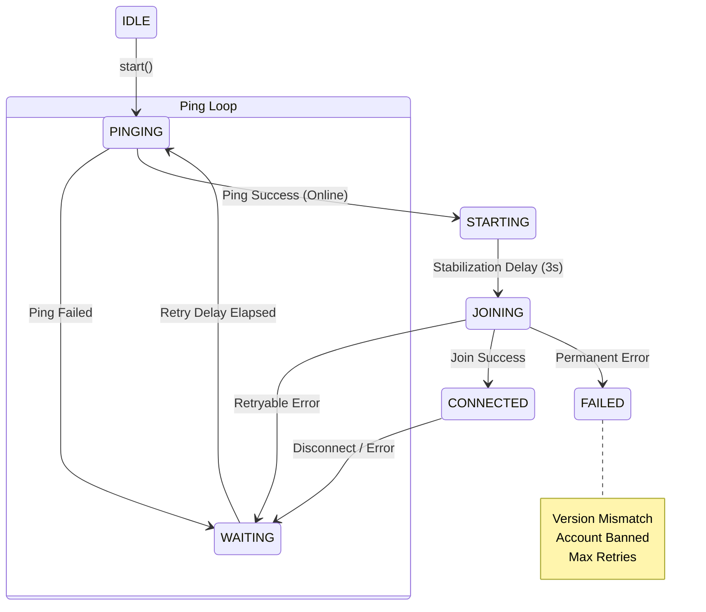

# 🏗️ Minecraft Bedrock Connection Orchestrator

> **A production-ready, intelligent state machine for managing Minecraft Bedrock bot connections.**

---

## 🌟 Introduction

The **Connection Orchestrator** replaces the traditional "blind retry loop" with a smart, state-driven connection manager. It is designed specifically to handle the complexities of joining free tier hosts like Aternos, where servers take time to boot, connections can be refused during startup, and immediate join attempts can lead to lengthy TCP timeouts.

Instead of retrying every 60 seconds and hoping the server is online, the Orchestrator acts like a real game launcher: it pings the server using cheap UDP packets to verify it is online and stable *before* attempting a full join.

---

## ✨ Key Features & Capabilities

Here is everything the new Connection Orchestrator can do:

### 🧠 1. Explicit State Machine (FSM)
- Connections follow a strict, validated path: `IDLE` ➔ `PINGING` ➔ `STARTING` ➔ `JOINING` ➔ `CONNECTED`.
- Eliminates race conditions (e.g., trying to join while already joining).
- Prevents infinite loops by explicitly moving to a `FAILED` state on terminal errors.

### 📡 2. Smart UDP Pre-Pinging
- **The Problem:** A failed TCP join attempt takes ~20 seconds to time out.
- **The Solution:** The Orchestrator uses a rapid UDP Ping (~200ms) to check the server's status, MOTD, and player count without establishing a full session.
- **Result:** Saves time, reduces unnecessary load on the server, and detects the exact moment the server finishes booting.

### 📈 3. Adaptive Exponential Backoff
- When a connection fails, it doesn't wait a fixed 60 seconds.
- Uses an adaptive curve (e.g., 2s, 4s, 8s, 15s, 30s, 60s) with added **jitter** (±10% randomness).
- This ensures the bot catches the exact moment the server comes online without creating a "thundering herd" effect if multiple bots restart simultaneously.

### 🛡️ 4. Intelligent Error Classification
- Not all errors are equal. The `ErrorClassifier` analyzes every disconnect or failure:
  - **RETRYABLE**: Server starting, connection refused, timeout, kicked. (Triggers the backoff scheduler).
  - **PERMANENT**: Version mismatch, protocol mismatch, banned, invalid session. (Immediately stops the bot and marks it as `FAILED` to prevent account flags).

### 📊 5. Metrics & Telemetry
- Tracks detailed health metrics:
  - Total successful joins vs. total failures.
  - Average startup time (how long it takes from start to joined).
  - Average ping latency.
  - Average connection lifetime (how long the bot stays online before being disconnected).

### 🔄 6. Stabilization Delays
- Aternos servers often report "online" via ping a few seconds before they can actually accept a player connection.
- The Orchestrator introduces a `STARTING` state (a 3-second stabilization delay) after a successful ping before attempting the join, drastically increasing first-try join success rates.

---

## 🏗️ Architecture Modules

The system is broken down into 7 decoupled, focused modules:

| Module | Responsibility |
| :--- | :--- |
| 👑 **ConnectionManager** | The top-level orchestrator. Drives the state machine through the connection lifecycle. |
| 🛤️ **ConnectionStateMachine**| An explicit FSM that validates all state transitions and maintains history. |
| 🏓 **BedrockPingService** | Handles UDP status probes with timeouts and internal packet-loss retries. |
| 🕹️ **JoinExecutor** | Manages the actual `bedrock-protocol` client, AFK movement loops, and active session teardown. |
| ⏱️ **RetryScheduler** | Manages the adaptive exponential backoff timer with first-class cancellation support. |
| 🕵️ **ErrorClassifier** | Inspects error strings and categorizes them as `RETRYABLE` or `PERMANENT`. |
| 📝 **Logger & Metrics** | Structured, leveled event logging and in-memory tracking of connection health data. |

---

## 🔄 State Machine Flow Diagram

---

## 🆚 Before vs. After Comparison

| Feature | Old System | New Connection Orchestrator |
| :--- | :--- | :--- |
| **Logic Type** | Blind recursive function | Explicit Finite State Machine |
| **Server Detection** | Try to join, wait 20s for timeout if offline | Ping via UDP (200ms), join only when ready |
| **Retry Timing** | Fixed (e.g., every 60 seconds) | Exponential Backoff (2s → 4s → 8s → 60s) |
| **Error Handling** | Retry on everything | Abort on permanent errors (Version Mismatch) |
| **Graceful Shutdown**| Hanging sockets, duplicate bots | Clean cancellation via Abort mechanism |
| **AFK Movement** | Continued running if socket died | Tied explicitly to the active `JoinExecutor` session |

---

## 🛠️ How to View Logs

The new `Logger` module outputs structured, visually distinct logs to the console. You will now see clear emojis and distinct events in your bot panel logs, such as:

- 🔍 `[Orchestrator] [Orchestrator] PING_START`
- 📋 `[Orchestrator] [Orchestrator] STATE_CHANGE {"from":"PINGING","to":"STARTING"}`
- ⚠️ `[Orchestrator] [Orchestrator] JOIN_FAILED {"code":"ETIMEDOUT"}`
- ❌ `[Orchestrator] [Orchestrator] PERMANENT_FAILURE {"code":"VERSION_MISMATCH"}`

*These metrics will eventually be exposed via the API to power beautiful dashboard charts.*
