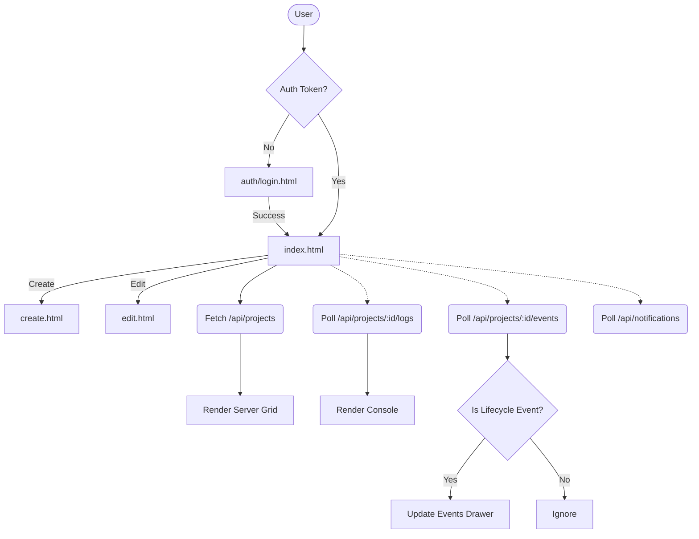

# Frontend Architecture

---

# Overview

- **Framework**: Vanilla HTML, CSS, and JavaScript. No modern frontend frameworks (e.g., React, Vue, Angular) are used.
- **Language**: JavaScript (ES6+), HTML5, CSS3.
- **Package manager**: Not found in the codebase (no frontend package manager is used; it relies on direct CDN links).
- **Build system**: Not found in the codebase (files are served statically directly from the `public` directory without bundling or minification).
- **Rendering strategy**: Client-Side Rendering (CSR) via manual DOM manipulation.
- **Project goals (inferred)**: Provide a fast, lightweight, and highly stylized (glassmorphism/retro) web panel to manage Minecraft AFK bots (Java and Bedrock editions), monitor real-time console logs, and track lifecycle events, with seamless integration for Telegram Mini Apps.

---

# Directory Structure

```text
public/
├── 404.html                 # Custom 404 error page with 3D and canvas effects
├── assets/                  # Static media assets
│   ├── alex_mascot.png
│   ├── empty-server.png
│   ├── favicon.ico
│   ├── minecraft-icon.png
│   └── steve_mascot.png
├── auth/                    # Authentication feature module
│   ├── auth.css             # Styling specific to authentication pages
│   ├── login.html           # User login page
│   ├── signup.html          # User registration page
│   └── signup.js            # Client-side logic for the registration form
├── create.css               # Styling specific to the server creation page
├── create.html              # Interface for registering a new server instance
├── edit.html                # Interface for modifying an existing server instance
├── index.css                # Styling specific to the main dashboard
├── index.html               # Main dashboard for viewing and controlling servers
└── styles.css               # Global CSS variables, resets, and shared utility classes
```

### Responsibilities
- **`public/assets/`**: Holds all static images and icons used across the application.
- **`public/auth/`**: Encapsulates all views and logic related to user onboarding and authentication.
- **Root HTML files**: Act as independent entry points (pages) for the Multi-Page Application (MPA).
- **Root CSS files**: Provide global design tokens (`styles.css`) and page-specific layout rules.

---

# Routing

- **Routing system**: Multi-Page Application (MPA). The application relies on physical HTML files. Navigation is achieved via standard `<a>` tags and explicit `window.location.href` redirects in JavaScript.
- **Layouts**: Not found in the codebase. Layouts (Headers, Footers) are manually duplicated across HTML files.
- **Nested layouts**: Not found in the codebase.
- **Protected routes**: Implemented client-side. At the top of protected pages (`index.html`, `create.html`, `edit.html`), a script checks `localStorage.getItem('token')`. It performs a `/api/auth/verify` API call. If the token is missing or invalid, the user is redirected to `/auth/login.html`.
- **Dynamic routes**: Implemented via URL Query Parameters. For example, `edit.html?project=server_id` passes the target server ID to the edit view.
- **Route groups**: Logically grouped by folders (e.g., `/auth/`).
- **Middleware**: Not found in the codebase (handled by the backend).
- **Loading pages**: Not found in the codebase. Loading states are managed via inline button spinners.
- **Error pages**: Handled by `404.html`, which features a custom interactive 3D cube and canvas particle system.
- **Not-found pages**: Same as the error page (`404.html`).

---

# Application Flow

User opens app (`index.html`)

↓

**Routing**: Browser loads the physical `index.html` file.

↓

**Authentication**: 
1. Script checks for `?token=` in URL (for Telegram Mini App auto-login). If present, saves to `localStorage` and cleans the URL history.
2. Checks `localStorage.getItem('token')`. If missing, redirects to `/auth/login.html`.

↓

**Providers**: Not found in the codebase.

↓

**API**: An asynchronous `fetch` request is made to `/api/projects` using the Authorization header.

↓

**State updates**: Local JavaScript variables (e.g., `allProjects`, `currentServerIds`) are updated with the API response.

↓

**Rendering**: The script iterates through the state and constructs HTML strings using template literals, then assigns them to `serverGrid.innerHTML`.

↓

**UI**: The user sees the populated dashboard. Interacting with buttons (e.g., "Start") triggers new `fetch` requests, updating the UI via surgical DOM modifications (e.g., changing class names from `status-stopped` to `status-running`). Concurrently, background intervals (`setInterval`) poll the API for console logs and notifications.

---

# State Management

- **Identify**: Local state (vanilla JS variables scoped to the document/module).
- **React Context / Redux / Zustand / Jotai / MobX / Signals**: Not found in the codebase.

### Explain
- **What owns which state**:
  - `index.html` owns the server list (`allProjects`, `currentServerIds`), search queries (`searchQuery`), and notification/event tracking (`lastSeenEvent`, `popupsEnabled`).
  - `edit.html` owns the target server configuration state (`projectId`, `serverType`).
- **Shared state**: State is NOT shared between pages. Every page load requests fresh data from the API. The only truly shared state is the authentication JWT stored in `localStorage`.
- **Global state**: Not found in the codebase.
- **Derived state**: The filtered server list in `index.html` is derived dynamically by filtering the `allProjects` object against the `searchQuery` string during rendering.

---

# Component Architecture

- **Component hierarchy**: Monolithic per page. There is no formal component hierarchy.
- **Shared UI**: HTML for the Header, Footer, and Toast Notification containers is copy-pasted across `index.html`, `create.html`, `edit.html`, and auth pages.
- **Reusable components**: Achieved purely through CSS classes (e.g., `.btn`, `.glass-card`, `.form-group`, `.alert`). There are no reusable JS/HTML component functions.
- **Feature components**: Rendered dynamically via JavaScript template literals (e.g., the server card in `index.html`).
- **Container vs Presentational**: Logic and presentation are deeply coupled. The same script fetches data, processes it, and constructs the HTML markup.
- **Composition patterns**: Not found in the codebase.

---

# Feature Modules

### Dashboard (`index.html`)
- **Purpose**: Main hub for viewing servers, reading logs, tracking lifecycle events, and monitoring global bot notifications.
- **Main files**: `index.html`, `index.css`
- **API usage**: `/api/projects`, `/api/projects/:id/logs`, `/api/projects/:id/events`, `/api/notifications`, `/api/events`.
- **State**: `allProjects`, `currentServerIds`, `searchQuery`, `logPollInterval`.
- **Dependencies**: FontAwesome.

### Server Registration (`create.html`)
- **Purpose**: Form to register a new Minecraft server instance.
- **Main files**: `create.html`, `create.css`
- **API usage**: `/api/projects` (POST).
- **State**: Form input values.

### Server Configuration (`edit.html`)
- **Purpose**: Modify an existing server's IP, port, or version.
- **Main files**: `edit.html`, `create.css`
- **API usage**: `/api/projects/:id/status` (GET), `/api/projects/:id` (PUT).
- **State**: `projectId`, `serverType`.

### Authentication (`auth/`)
- **Purpose**: Handle user sign-up and login.
- **Main files**: `login.html`, `signup.html`, `signup.js`, `auth.css`
- **API usage**: `/api/auth/signup`, `/api/auth/login`.
- **State**: Form input values.

---

# API Layer

- **API clients**: Native `fetch` API.
- **fetch wrappers / axios**: Not found in the codebase.
- **Authentication**: JWT is manually retrieved from `localStorage` and injected into the headers: `'Authorization': 'Bearer ' + token`.
- **Request flow**: 
  1. Retrieve token.
  2. Invoke `await fetch(url, options)`.
  3. Parse `await res.json()`.
  4. Manually check `res.ok` or `data.success`.
- **Error handling**: Wrapped in `try/catch` blocks. Network errors or API errors (read from `data.error`) are piped to the `showToast` or `showError` UI helpers.
- **Retry / Interceptors**: Not found in the codebase.
- **Refresh token**: Not found in the codebase.
- **Serialization**: Standard `JSON.stringify()` for POST/PUT bodies.

---

# Authentication

- **Login flow**: User submits credentials -> `fetch` POST to `/api/auth/login` -> Backend validates and returns JWT -> Frontend calls `localStorage.setItem('token', token)` -> Redirects to `/`.
- **Logout**: Clears `localStorage.removeItem('token')` -> Redirects to `/auth/login.html`.
- **Protected pages**: Validated strictly on page load via inline scripts.
- **Cookies / Session**: Not found in the codebase.
- **JWT**: Used exclusively. Passed via Authorization header.
- **Refresh**: Not found in the codebase.
- **Permissions / Roles**: Not found in the codebase (handled implicitly by the backend).
- **Telegram Mini App Integration**: The app supports seamless login by checking for `?token=...` in the URL, storing it, and cleaning the URL history using `window.history.replaceState`.

---

# Forms

- **Validation**: Relies heavily on native HTML5 validation attributes (`required`, `min`, `max`, `minlength`).
- **Libraries / Schemas**: Not found in the codebase.
- **Submission flow**: `e.preventDefault()` prevents default POST -> Data is manually extracted from DOM elements (`document.getElementById().value`) -> Payload is formatted -> `fetch` POST/PUT is triggered.
- **Error handling**: Displays errors directly above the form using dynamically injected `.alert` DOM elements or dedicated error spans with CSS shake animations (`authShake`).

---

# Styling

- **CSS architecture**: Vanilla CSS.
- **Tailwind / CSS modules / Styled Components**: Not found in the codebase.
- **Theme**: Fixed dark mode with a distinct "premium glassmorphic" and retro/gamer aesthetic.
- **Dark mode**: Default and only mode.
- **Design tokens**: Managed globally in `styles.css` using CSS Variables (`:root`).
- **Typography**: Imports `Inter` for sans-serif UI elements and `JetBrains Mono` for monospace logs/events via Google Fonts.
- **Spacing**: Hardcoded padding and margin values relying on standard flexbox/grid gap layouts.

---

# Providers

- Not found in the codebase. Context and Providers are concepts from frameworks like React, which are not used here.

---

# Custom Hooks

- Not found in the codebase.

---

# Utilities

Defined inline within `<script>` tags across various pages:
- `escapeHTML(str)`: Mitigates XSS by escaping HTML entities before rendering.
- `cleanIPAddress(ip)`: Strips `http://`, `https://`, and `www.` from user input.
- `timeAgo(dateStr)`: Converts timestamps to relative time strings (e.g., "5m ago").
- `showToast(message, type)`: Dynamically generates and animates floating notifications.
- `severityIcon(severity)`: Maps notification severity to FontAwesome icons.

---

# Services

- Not found in the codebase as independent modules.
- **Business logic / Polling**: Embedded directly in `index.html` (e.g., `setInterval` for fetching logs, evaluating `isLifecycleEvent(msg)` to filter console output).

---

# Performance

- **Memoization / Lazy loading / Dynamic imports / Suspense**: Not found in the codebase.
- **Image optimization**: Not found in the codebase.
- **Caching**: Local memory caching is used briefly for available Minecraft versions (`editVersionsCache` in `index.html`).
- **Prefetching**: Not found in the codebase.
- **Server rendering**: Not found in the codebase.
- **Client rendering**: Direct manipulation of `innerHTML`. Surgical updates are used in `index.html` (e.g., updating just the `.status-indicator`) to avoid full layout thrashing when refreshing the server list.

---

# Error Handling

- **Global boundaries**: Not found in the codebase.
- **API errors**: Caught manually and displayed via Toast notifications (`showToast`).
- **Form errors**: Displayed via injected alert banners (`showErrorMessage`).
- **Fallback UI**: The `404.html` page acts as a fallback for unknown routes.
- **Logging**: Basic `console.error` usage.

---

# Configuration

- **Environment variables / Runtime config / Feature flags**: Not found in the codebase. API endpoints are hardcoded relative paths (e.g., `/api/projects`). 

---

# Security

- **XSS protection**: Handled manually via the `escapeHTML()` utility before inserting user-generated content (like server IPs, log output) into `innerHTML`.
- **CSRF**: Mitigated inherently by using JWTs in the `Authorization` header instead of relying on cookies.
- **Token storage**: Stored in `localStorage`. While vulnerable to XSS, the application's strict usage of `escapeHTML` mitigates this risk.
- **Input validation**: Basic client-side checks for port ranges and string lengths.

---

# Dependencies

- **FontAwesome (via CDN)**: Used extensively for UI iconography.
- **Telegram Web App SDK (via CDN)**: Exists to integrate the panel inside the Telegram Mini App ecosystem (allows closing the app after creating a server).
- **Google Fonts**: Provides `Inter`, `JetBrains Mono`, and `Press Start 2P`.

---

# Architecture Diagram



---

# Improvements

### Critical
- **Security / Architecture**: Token storage in `localStorage` alongside raw `innerHTML` DOM manipulation is a high-risk combination for XSS. A minor mistake in `escapeHTML` usage could expose user tokens.

### High
- **Duplication (DRY Principle)**: The HTML for Headers, Footers, and Toast logic is duplicated across every `.html` file.
- **Maintainability**: Building complex HTML structures using multi-line template literals inside `.innerHTML` (as seen in `index.html`) is difficult to maintain and scale.

### Medium
- **Performance / API Load**: The application uses aggressive HTTP polling (`setInterval` every 2-3 seconds) to fetch logs and events. Implementing **WebSockets** or **Server-Sent Events (SSE)** would drastically reduce network overhead and improve real-time responsiveness.
- **Architecture Smells**: Logic is heavily intertwined with the view layer (DOM manipulation inside API resolution blocks). 

### Low
- **Build System**: Introducing a lightweight build step (like Vite) would allow for CSS minification, JS obfuscation, and breaking the code into actual ES modules for better developer experience.

---

# Missing Documentation

- There is no frontend-specific developer documentation (e.g., `README.md` for the `public` directory) detailing how to run the frontend locally or explaining the structure.
- The `escapeHTML` and event filtering logic (`isLifecycleEvent`) are completely undocumented and rely on magic strings.

---

# Glossary

- **Lifecycle Event**: A specific log output from the bot (e.g., "started", "uzildi", "reconnect") that the frontend parses out of the raw logs to display in a cleaner "Events" timeline.
- **Glassmorphism**: The UI design trend used heavily in this project, characterized by semi-transparent backgrounds, blurs (`backdrop-filter`), and subtle borders.
- **Vanilla Tech**: Referenced in the footer, indicating the deliberate choice to build the UI without modern JS/CSS frameworks.
- **Telegram Mini App**: The frontend supports running as an embedded webview inside Telegram, utilizing URL tokens to bypass manual login.
